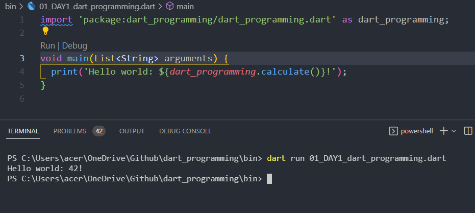

# Bahasa Pemrograman Dart

Pengertian Bahasa Pemrograman Dart
Bahasa pemrograman multiguna (bahasa pemrograman dengan tujuan umum), Dart, yang dapat digunakan dalam mengembangkan berbagai jenis aplikasi dan program yang digunakan dalam mengembangkan aplikasi web, aplikasi seluler, aplikasi desktop, server, dll.

Dart merupakan programming language lintas platform atau platform independen yang artinya dapat dijalankan pada sistem operasi yang berbeda seperti Windows, Linux, Unix dan MacOS, dll yang awalnya dikembangkan oleh Google dan kemudian disetujui sebagai standar oleh Ecma, yang saat ini digunakan untuk membangun aplikasi web, server, desktop, dan seluler.

Dart awalnya dirancang sebagai programming language yang dioptimalkan klien untuk pengembangan cepat aplikasi web dan seluler.

Sebagai salah satu dari banyaknya programming language yang mendukung multi paradigma, Dart, bersifat imperatif, fungsional, reflektif dan berorientasi objek. Selain itu, Dart juga mengikuti semua konsep pendekatan pemrograman berorientasi objek seperti kelas, pewarisan, abstraksi, enkapsulasi, dan polimorfisme, dll. Dart juga merupakan tipe bahasa pemrograman yang sangat kuat yang menyediakan fitur pengumpul sampah otomatis. Bahasa Dart sendiri bersifat open source yang dilisensikan di bawah BDS. Sintaks nya merupakan sintaksis gaya-C sederhana.

Sejarah Dart
Dart dirancang dan dikembangkan oleh Lars Bak dan Kasper Lund di Google yang secara resmi diperkenalkan pada Oktober 2011 di Konferensi GOTO, Denmark dan versi pertama Dart yaitu versi 1.0 resmi dirilis pada Nov 2013.

Untuk menstandarisasi programming language yang baru dibuat, Ecma International membuat komite teknis yang dikenal sebagai TC52, dan Fakta bahwa kode Dart dapat dikompilasi ke dalam JavaScript telah membuat bahasa ini cukup kompatibel dengan banyak browser web modern. Hal ini menyebabkan standardisasi yang tak terhindarkan pada Juli 2014, ketika Ecma International menyetujui edisi pertama spesifikasi bahasa Dart di Majelis Umum ke-107 badan internasional tersebut.

Sekitar enam bulan kemudian, pada bulan Desember 2014, edisi lain dari spesifikasi bahasa Dart telah disetujui oleh Ecma International. Ini adalah edisi kedua dari spesifikasi bahasa Dart.

Kompiler pertama yang dapat menghasilkan kode JavaScript dari Dart dikenal sebagai dartc, tetapi kemudian dikutuk oleh Google. Itu diikuti oleh Frog, kompiler yang ditulis dalam Dart, tetapi tidak dapat mengkompilasi kode sepenuhnya. Kompiler ketiga adalah dart2js yang juga ditulis dalam Dart dan masih digunakan.

Fitur Bahasa Pemrograman Dart
Ada sepuluh fitur Dart yang menjadikannya salah satu bahasa pemrograman populer, yaitu:

1. Cross Platform (lintas platform)
   Dart merupakan programming language lintas platform atau platform independen yang berarti dapat dijalankan pada sistem operasi yang berbeda seperti Windows, Linux, Unix dan MacOS, dll.

2. General Purpose (tujuan umum)
   Dart bersifat multiguna (dengan tujuan umum) yang artinya dapat digunakan dalam mengembangkan berbagai jenis aplikasi dan program.

3. Multi-paradigm (multiparadigma)
   Dart mendukung multi paradigma seperti pemrograman imperatif, fungsional, reflektif dan berorientasi objek.

4. Object-Oriented (berorientasi pada objek)
   Dart adalah pemrograman berorientasi objek dan mengikuti semua konsep pendekatan pemrograman berorientasi objek seperti kelas, pewarisan, abstraksi, enkapsulasi, dan polimorfisme, dll.

5. Simple Syntax (sintaks yang sederhana)
   Sintaks Dart adalah sintaksis gaya-C sederhana. Programmers pemula dapat dengan mudah mempelajari sintaks Dart.

6. Automatic Garbage Collector (pengumpul sampah otomatis)
   Dart adalah bahasa yang sangat diketik yang menyediakan fitur pengumpul sampah otomatis.

7. Compiled Programming Language (bahasa pemrograman yang dikompilasi)
   Dart merupakan programming language yang memenuhi syarat yang berarti bahwa kompiler digunakan untuk mengubah kode yang ditulis dalam bahasa pemrograman Dart menjadi bahasa asli atau JavaScript sebelum dieksekusi.

8. Open Source (sumber yang terbuka)
   Dart adalah bahasa pemrograman open source yang dilisensikan di bawah BDS.

9. Inbuilt Libraries (perpustakaan bawaan)
   Dart menyediakan berbagai macam perpustakaan inbuilt kelas kaya.

## Contents

- [01_DAY1_dart_programming.dart](#Prerequisites)
- [02_DAY1_Variable.dart]()
- [Why it is Important]()
- [When we use]()
- [How to implement in a Flutter Project]()
- [Used Languages](#Used-Languages)

# Implementation

# Dart programming

